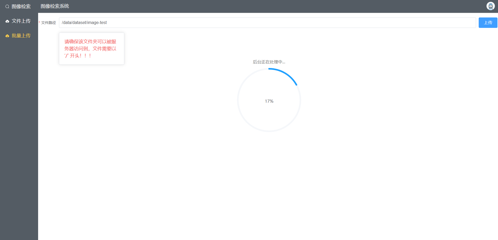
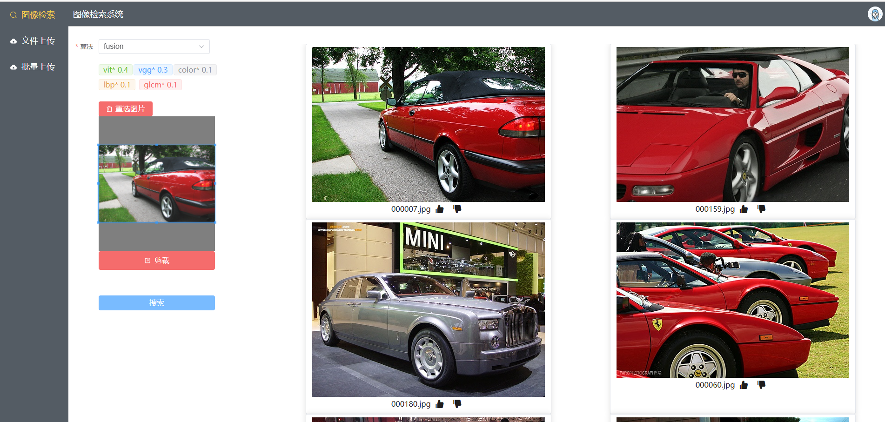

# retrieval-mf

retrieval-multi-feature 基于多特征融合的图像检索系统。

request：`python >= 3.9 torch>=1.10.1`

## Introduction

这是一个基于多特征融合的图像检索系统。核心部分主要分为**图像特征的提取**与**特征向量检索**两部分：

- 特征提取。目前主要包括传统特征：颜色、纹理、glcm特征；深度学习特征：vgg、vit。
- 向量检索。使用向量数据库milvus，具体见`docs/design.md`。

特征向量存放在milvus中便于比对，图片存储在文件服务器，其他元数据信息存储在mysql中。

用户首先需要将图片文件夹上传至服务器，然后开始提取特征形成特征库。之后用户可以通过上传一张图片来检索已经入库的文件中最相似的图片，并展示在页面上。

## Install

### milvus

milvus是专门设计用于处理对输入向量的查询的数据库，它能够以万亿级对向量进行索引。

使用`docker-compose`启动，具体见：[Install Milvus Standalone with Docker Compose Milvus documentation](https://milvus.io/docs/install_standalone-docker.md)

### attu

attu是milvus的开源可视化管理工具，不安装系统也可以正常启动。

docker安装启动attu，具体见：[Install Attu with Docker Compose Milvus documentation](https://milvus.io/docs/attu_install-docker.md)

```bash
docker run -p 8000:3000  -e MILVUS_URL={your machine IP}:19530 zilliz/attu:v2.2.3
```

### mysql

建议使用`docker`安装启动，如：

```bash
docker run --restart=always -itd --name mysql-test -p 3306:3306 -e MYSQL_ROOT_PASSWORD=123456 mysql
```

### fileserver

项目中实现了一个简单的HTTP文件服务器，在`utils/file_server.py`，进入`utils`文件夹后启动：

```bash
python file_server.py
```

### server

安装好python的虚拟环境后，安装依赖并启动项目：

```bash
# 安装依赖项
pip install -r requirements
# 启动项目，可以通过 -c 参数指定配置文件，默认为 conf/conf.ini
python server.py
```

## Usage

需要先建库，然后在库中搜索相似图片。

### 批量上传

确保需要添加的图片文件夹放在服务器可以访问到的位置！！！然后在批量上传界面输入文件夹的绝对路径，点击上传按钮，若成功，则可以看到后台正在处理的进度条。



### 图像检索

上传一张图片，检索相似图片。其中可以通过下拉框选择不同的算法，通过调整截取框的位置使用部分图片进行检索。

需要注意，即使图片相似度很低，也依然会返回固定数量的结果。

