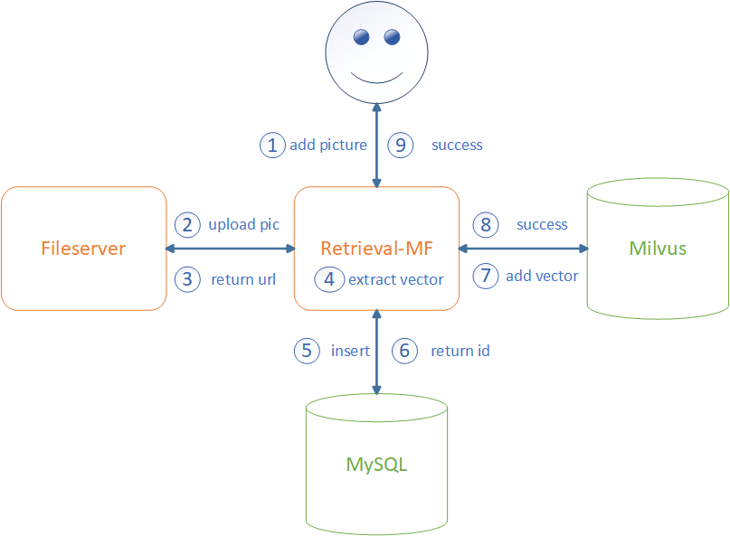
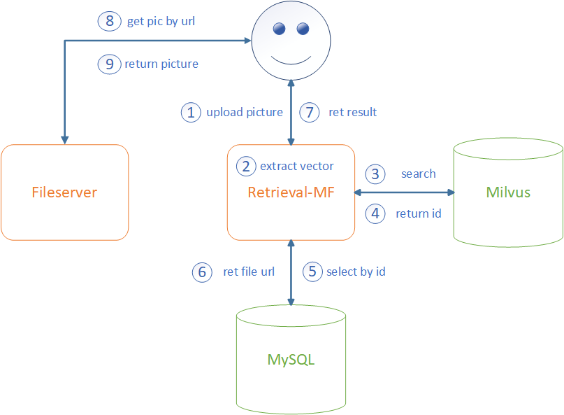
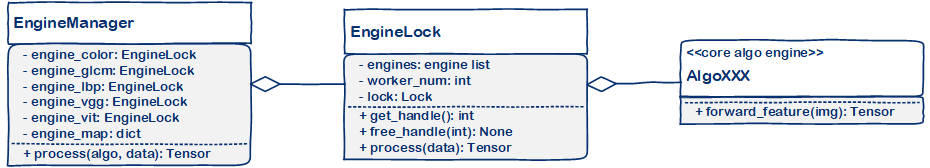

# Design

## 优化

之前简单实现了一版图像检索系统，但是很多地方不够满意，特别是在客户现场部署时遇到了非常多的问题，因此重构了一版，主要做了以下优化：

1. 建库时，不同算法提取特征时只读取一次图片文件。
2. 增加`http`文件服务器，同时存储原图的缩略图，检索接口不再直接返回base64图片，提高单次检索的响应速度。
2. 完全采用`B/S`架构，移除了对`qt`的支持。
3. 更新算法，`timm == 0.6.12`，经过小论文实验对比发现旧的`vit`算法较新版的算法差距还挺大的。
4. 特征提取与特征比对模块分离，做到低耦合。
4. 根据算法名称调用对应算法，不再使用`if else`语句，转为使用字典。
4. web框架中使用统一的参数验证与错误异常处理。
5. 增加引擎管理，支持多线程提取特征，支持多用户同时操作。
6. 使用orm框架操作mysql。
6. 使用数据库中的id做为一张图片的唯一id，向量比对时返回该唯一id，这样便于运行时增加与删除数据。
7. 使用向量数据库milvus，不再单独使用faiss或程序在内存中管理向量数据，解决数据一致性问题。当然，依然提供不使用milvus的版本，只需要修改配置文件就可以不依赖milvus启动。

## milvus

- milvus是什么？

  作为专门设计用于处理对输入向量的查询的数据库，它能够以万亿级对向量进行索引。与现有关系数据库主要按照预定义模式处理结构化数据不同，Milvus 是自下而上设计的，用于处理从非结构化数据转换的嵌入向量。具体见其官方文档：

  https://milvus.io/docs

  https://github.com/milvus-io/milvus-docs

- 为什么不直接使用faiss？
faiss（Facebook AI Similarity Search）可以理解为提供了一种检索算法，避免了暴力搜索算法存在的问题。由于faiss需要将数据加载到内存中才可以进行处理，则有数据落盘的需求，以及系统在线时插入一条数据存在数据一致性问题。而milvus底层其实可以选择使用faiss进行特征比对，且已经解决了上述问题。此外，faiss只可以在linux上使用，而milvus可以使用docker部署在各类系统中。

- 有milvus为什么还要mysql？
因为对于图片名这类字段，也需要建立索引后续通过图片名称来检索。虽然milvus自2.1.0版本后引入了标量字段索引，但当前版本最高为2.2.x，因此对其性能以及稳定性持怀疑态度，所以决定还是尽量只使用其矢量搜索的功能。此外，由于保留了暴力检索的方法便于调试比对，mysql中也存储了向量数据。

**NOTE**: pymilvus必须和milvus的版本对应。此外，如果要对milvus相关模块进行修改，一定要先通读一遍[官方文档](https://milvus.io/docs)！！！

## 系统架构

### API层

以下展示两个核心API接口接到用户请求以后，内部的逻辑状态，即向系统中增加一副图片以及用图片进行检索。

#### 增加图片

#### 检索图片

### Manage

#### 引擎管理

由于深度学习的算法推理时不可以多线程同时调用，想要支持多线程必须初始化多个对象，因此需要对多个算法实例进行管理。

`core`包中主要包含了各种特征提取算法，每种算法都提供了相同的接口函数，便于做引擎的管理。

`utils/engine.py`则实现了对**单一算法**的管理，可以使用初始化好的同一类多个算法实例来初始化`EngineLock`对象，使用者只需要调用`process`函数即可处理数据。注意：若当前没有可用的引擎，则直接抛出异常，而不会阻塞等待。

`manage/engine_manage.py`中`EngineManager`实现了对所有算法的统一管理，调用时根据需要的算法名称调用对应的算法处理函数。

以下是一个非标准的UML类图，展示了其中的关系：

#### 数据管理

为了便于api层使用，`manage/db_manage.py`对关系型数据库`MySQL`和向量数据库`Milvus`进行了统一管理。

其中检索时除了使用`dao/milvus.py`中的`Milvus`，也支持使用`dao/cosine.py`中的`Cosine`，因为他们实现了同样的`insert`和`search`接口，由配置文件指定使用的比对方式。它们都需要将数据加载到内存中，然后进行比对。不同之处在于，`Milvus`可以自动管理数据的加载与落盘，且可以给向量建立索引加快搜索速度，而`Cosine`需要从mysql中获取向量数据加载到内存中，且检索时是通过暴力比对得出结果。